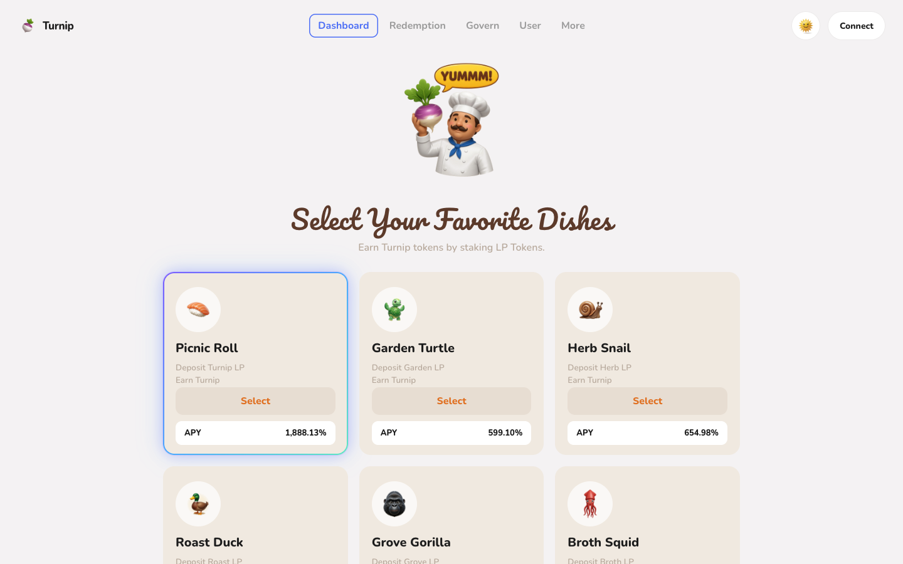
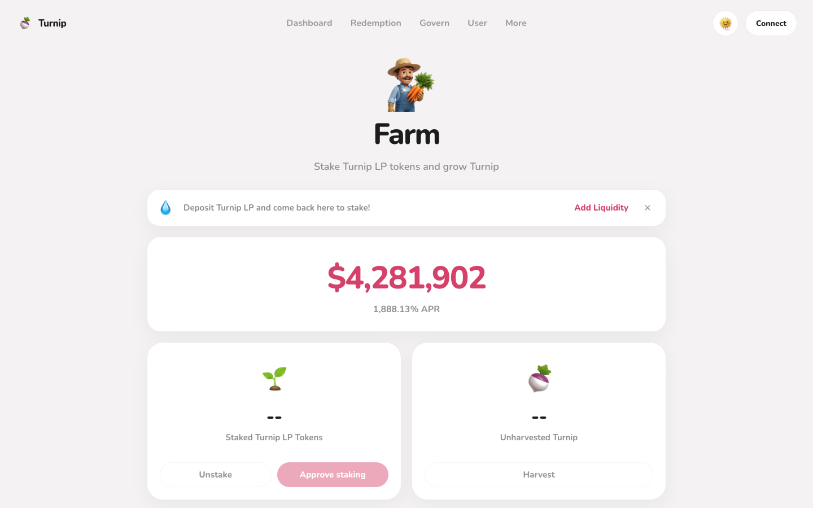
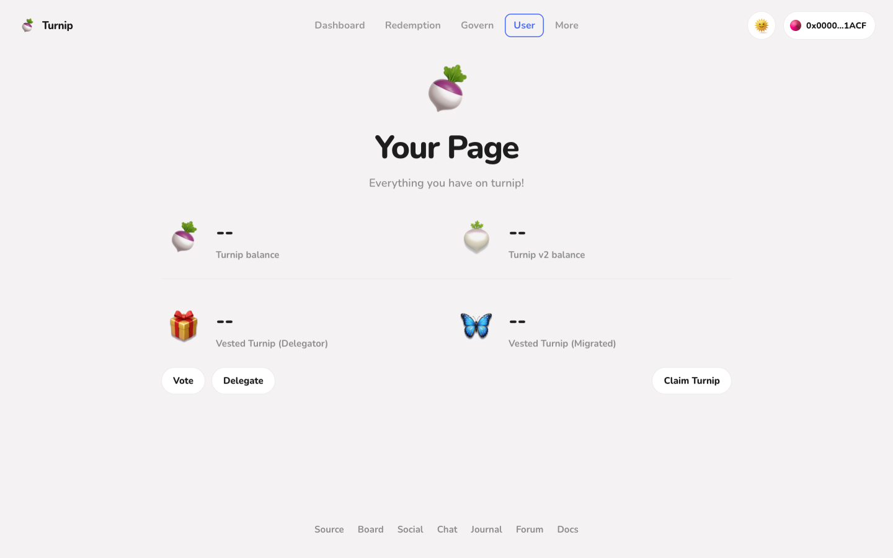

# Turnip

DeFi Summer UI. Cool gray canvas, extra-bold Nunito, 3D food mascots, magenta pills.

Summer 2020 yield apps looked like this. SushiSwap's dish picker ("Select Your Favorite Dishes") and Yam.finance's farm and user pages set the chrome: a centered mascot, round sans, cream selection cards, and one loud CTA. Turnip restates that look as a demo site.

This repo is the site plus two ways to reuse the chrome. Pick one.

- **[DESIGN.md](./DESIGN.md)** - standalone visual spec
- **[skill/SKILL.md](./skill/SKILL.md)** - standalone agent skill (`turnip-ui`)

Do not load both. Either file is enough.



Farm and account screens, after Yam.finance:




## Run the site

```bash
npm install
npm run dev
```

Then open the local URL Vite prints.

## Install the skill

The skill is named `turnip-ui`. It is self-contained. Copy `skill/SKILL.md` into your agent skills folder.

**Grok**

```bash
mkdir -p ~/.grok/skills/turnip-ui
curl -fsSL https://raw.githubusercontent.com/aaronjmars/turnip-ui/main/skill/SKILL.md \
  -o ~/.grok/skills/turnip-ui/SKILL.md
```

**Claude Code**

```bash
mkdir -p ~/.claude/skills/turnip-ui
curl -fsSL https://raw.githubusercontent.com/aaronjmars/turnip-ui/main/skill/SKILL.md \
  -o ~/.claude/skills/turnip-ui/SKILL.md
```

From a local clone, copy instead of curl:

```bash
mkdir -p ~/.grok/skills/turnip-ui
cp skill/SKILL.md ~/.grok/skills/turnip-ui/SKILL.md
```

Then say `/turnip-ui` or "build a settings page in turnip-ui style".

## Use DESIGN.md instead

If you would rather not install a skill, point an agent at [DESIGN.md](./DESIGN.md) and ask it to build a page from that spec. Same language, no skill file required.
